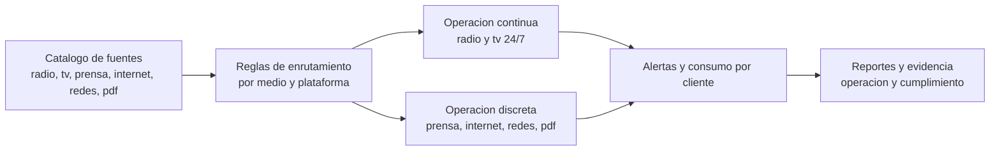
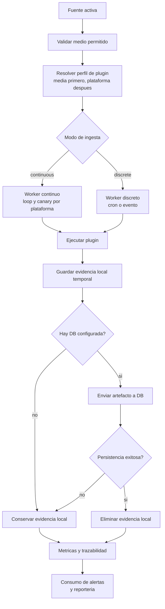
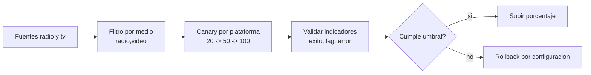

# Diagramas de Negocio y Flujo - Workers y Plugins

Fecha: 2026-06-04

## 1. Vista de negocio (no tecnica)

Este diagrama muestra como se separa la operacion para escalar por tipo de medio sin cambiar el catalogo base de fuentes.

## 2. Flujo operativo (end to end)

Este flujo resume como se procesa una fuente desde su entrada hasta la salida de evidencia.

## 3. Flujo canary para migracion radio y tv

## 4. Archivos de configuracion de referencia

1. Sources de entrada: apps/media-core-worker/stage/capture-sources.example.json
2. Perfiles de plugins: apps/media-core-worker/stage/plugin-profiles.example.json
3. Opciones de workers: apps/media-core-worker/stage/worker-options.example.json

## 5. Regla de negocio clave

1. El catalogo base de fuentes no se altera.
2. La logica de ejecucion vive en perfiles de plugin.
3. El crecimiento de canales se resuelve agregando perfiles, no reescribiendo el core.
4. La evidencia local no es almacenamiento permanente: se limpia cuando la persistencia en DB fue exitosa.
